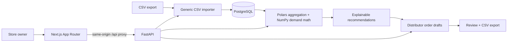

# Architecture

BottleIQ is one API, one web application, and one PostgreSQL database. No worker, Redis, POS integrations, or external AI service is required.

The web renders all customer data through authenticated API calls. An HttpOnly cookie is forwarded by Next.js, so browser code never handles a bearer token. `auth.py` provides the replaceable principal boundary; `editor` enforces owner/admin writes. Server-side store ownership is resolved before analysis or writes.

`services/calculations.py` contains pure math; `analytics.py` loads tenant-scoped records, aggregates daily sales with Polars, and returns typed metrics. API route modules perform HTTP validation, authorization, and orchestration. Smart Order estimates are persisted snapshots of the recommendation, not live formulas that change underneath an owner.

Imports are synchronous, bounded to 10 MB / 100,000 rows, with database savepoints for row isolation. SQL duplicate keys are preloaded once per job to avoid repeated scans of an uncommitted sales table. CPU/database ingestion runs off the ASGI event loop. The Next.js proxy allows five minutes for imports. Deploying behind another proxy requires compatible body-size and timeout settings. For larger stores, use a durable job queue and incremental aggregation before raising the limits.

PostgreSQL is the production database. SQLite is supported only for fast, self-contained developer tests; PostgreSQL integration tests check database foreign keys and transactional behavior. CI also upgrades, checks, downgrades, and re-upgrades the Alembic migration.

The UI uses restrained shared components, Tailwind v4, Lucide icons, and Recharts. Charts enhance decisions; data tables, plain-English reasons, and editable cases remain primary. Browser state holds only selections, filters, and pending edits. API calculations remain authoritative.

## Runtime boundaries

- Browser → Next.js: port 3000 locally; HTTPS at deployment.
- Next.js → API: loopback port 8000 locally; private networking at deployment.
- API → PostgreSQL: local Compose port 5432; private database at deployment.
- `/health` runs a database connectivity query; `/docs` and `/openapi.json` describe the API.
- Structured request logs include a server-generated request ID, path, status, and elapsed time; no CSV contents or auth cookies.

## Scaling limits

Analytics currently load a store's sales window and snapshot history on each request, and inventory filtering/pagination is client-side. This is suitable for validating small-store workflows, not a claim of warehouse-scale performance. Import fingerprint caches scale with existing history. Add bounded key queries, materialized aggregates, server pagination, and load tests against actual pilot volumes next.
