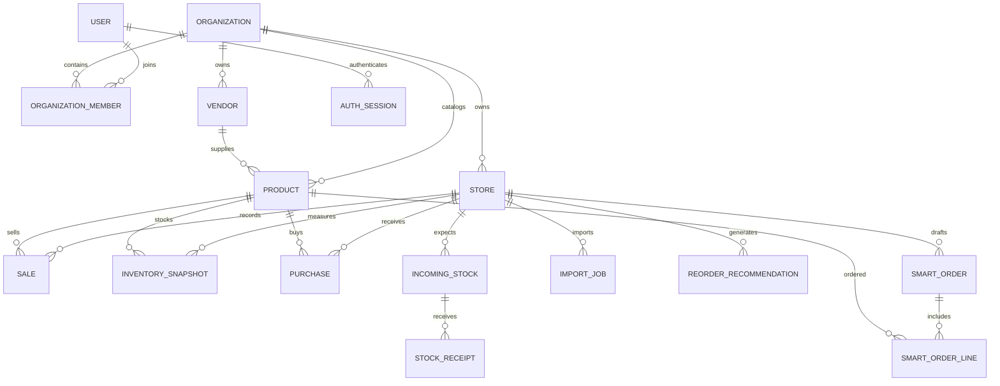

# Data model

UUID strings identify records. Timestamps are UTC; business dates follow each store's IANA timezone. Currency is fixed-point SQL `NUMERIC`; analytics serialize floats for display, while draft line and order totals use Python `Decimal` arithmetic. The initial currency is USD, and quantities are whole retail units.

All business records have `organization_id`. Store/product/vendor references use **composite foreign keys** containing organization ID, preventing a fact or order line from referencing another customer's entity even if application code errs. Unique constraints on `(id, organization_id)` support these links. User and organization membership are the identity boundary; users currently choose one organization at signup, with no organization-switching UI.

Notable constraints:

- Product SKU is unique per organization; preserve leading zeros. UPC is optional and not unique.
- Distributor name is unique per organization.
- Daily fact identity is unique per store via `source_key`; a separate content hash detects conflicting data.
- Import identity is `(store_id, import_type, file_hash)` where file hash includes mapping.
- One product per Smart Order line; quantities and amounts cannot be negative.
- Case packs must be positive. Vendor lead times cannot be negative.
- Store/product facts and date indexes support common lookups.

`InventorySnapshot` is a point-in-time quantity, not a perpetually updated stock ledger. Purchases do not automatically increment it; sales do not decrement it. `IncomingStock` records expected units and `StockReceipt` records each actual receipt, timestamp, and recording user. Analytics add receipts after the latest physical snapshot to estimated on-hand stock and subtract them from open incoming; a later snapshot supersedes those adjustments. Import fresh snapshots regularly. Snapshot cost is the latest cost basis used for intelligence; invoice history is retained for future landed-cost analysis. Returns, transfers, damage, and shrink remain outside this limited receipt ledger.

`ReorderRecommendation` retains generated results. `SmartOrder` has a version counter and immutable original explanations/cost basis. A write locks the order in PostgreSQL and checks the client's version before applying case edits. A zero-case line is an exclusion, retained in the draft but omitted from export. User edits never change the underlying inventory.

`AuthSession` stores only a SHA-256 digest of a cryptographically random token and a 12-hour expiration. Password hashes use Argon2. Logout removes the session. There are no plaintext passwords or stored uploaded CSV files.

Migrations are explicit frozen revisions, not calls to current metadata. Do not edit existing migrations once deployed; create a new revision.
